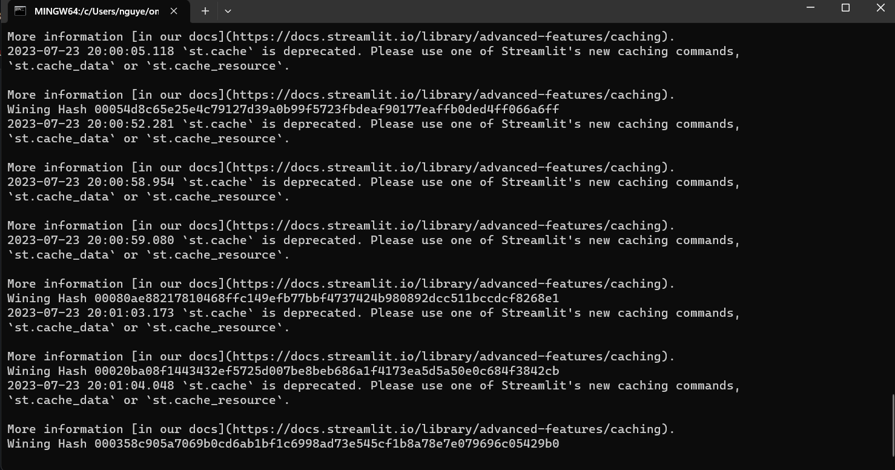
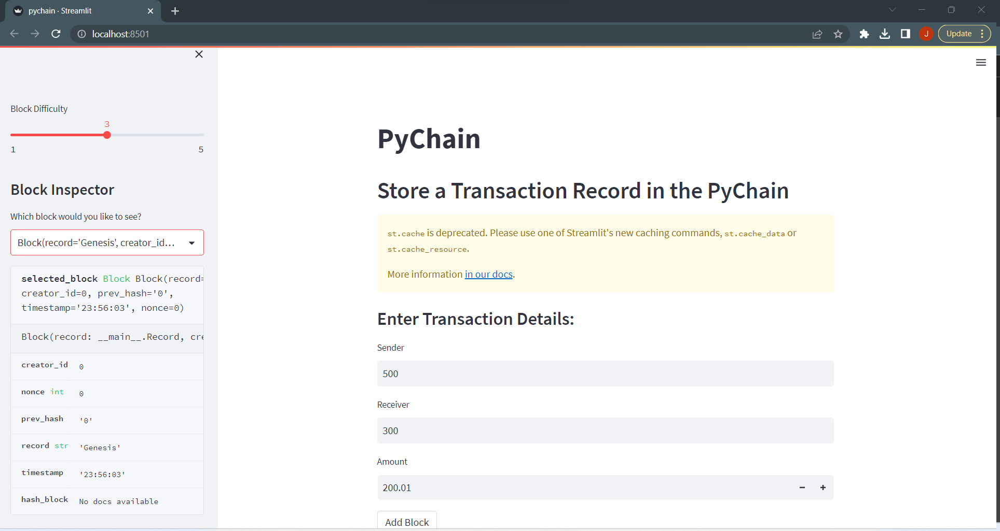
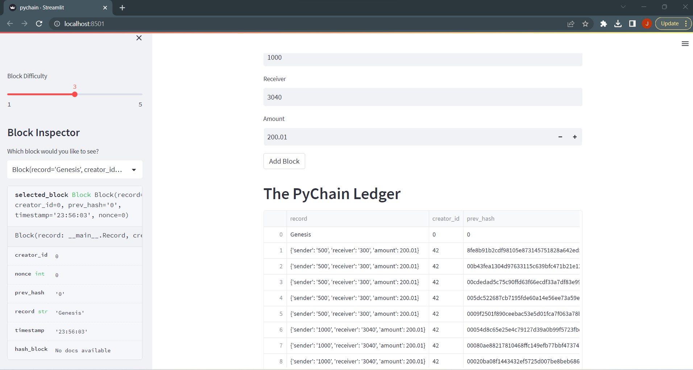
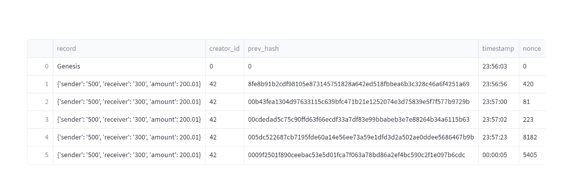

# Module_18_Challenge
# PyChain Ledger

Hello, this project is about Blockchain. Blockchain is a decentralized and distributed digital ledger technology that allows multiple participants to maintain a single version of truth in a secure and transparent manner. It was initially introduced as the underlying technology for the cryptocurrency Bitcoin, but its potential applications extend far beyond digital currencies.

---

## Technologies

pandas is a software library written for the Python programming language for data manipulation and analysis. Blockchain technology has numerous applications beyond cryptocurrencies. It has been explored in fields such as supply chain management, healthcare, voting systems, digital identity management, real estate, and more. Its potential to provide trust, security, and efficiency in various industries has garnered significant attention and interest from businesses and governments worldwide.

## Installation Guide

Import the correct packages to begin coding.

# Imports
import streamlit as st
from dataclasses import dataclass
from typing import Any, List
import datetime as datetime
import pandas as pd
import hashlib

---

## Usage

Use Plots and data frame to get the correct portfolio

---

## Contributors

-Name: John Nguyen
-Email: nguyenjohn1337@gmail.com

---

## License

Specify the details of your project’s license - that is, how others can or cannot use your code and files.
